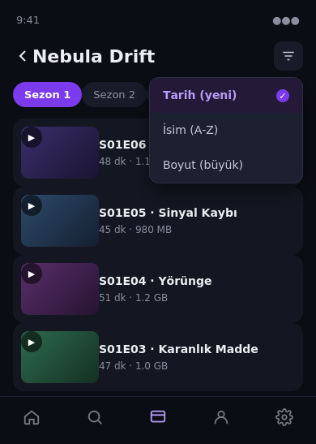
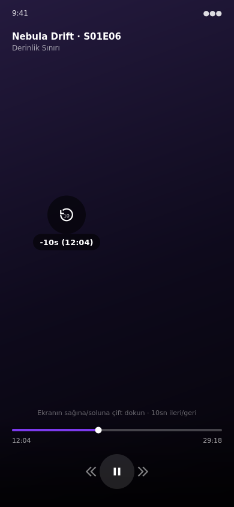

# TelePlay 2.0

**A private, Telegram-backed media center for your browser and your Android phone or tablet.**

TelePlay lets you send media to a Telegram bot, keep the source files in a private Telegram storage channel, and stream them on demand through a self-hosted application. It automatically indexes filenames into searchable series, actors, quality, and codec facets, and organizes everything into a cinematic home dashboard with continue watching, favorites, collections, and full-text search.

<p align="center">
  
</p>

<p align="center">
  <a href="https://github.com/Psrpis/Teleplay-2"></a>
  
  
  
  
</p>

> **Design note:** The screenshots in this README are product mockups built with mock/sample titles to communicate the visual language. No real library content is shown.

## What TelePlay 2.0 provides

| Capability | What it does |
| --- | --- |
| Private Telegram storage | Stores media in a private Telegram channel; only file references and metadata live in the app's own database. |
| On-demand streaming | Streams Telegram content through the FastAPI player path without requiring a full local download first. |
| Cinematic Home | Featured item plus Continue Watching, Favorites, Recently Added, Recently Watched, and Collections shelves. |
| Playback memory | Tracks current position, progress percentage, watched state, and viewing history — with a way to clear history without deleting the underlying file. |
| Automatic indexing | Reads filename patterns for series, seasons, episodes, actors, quality, and codec, including files uploaded as raw Telegram "documents" to avoid re-encoding. |
| Smart search | Searches filenames, cached metadata, and every series/actor tag in one query — matching regardless of whether the name uses dots, underscores, or spaces. |
| Series and actor discovery | Groups episodes and appearances by normalized tags, independent of folder placement, with a compact per-series sort control (date, name, or size). |
| Automatic thumbnails | Backfills a thumbnail for any video that doesn't have one yet (common for files sent as documents), by extracting a frame with `ffmpeg`. |
| Personal organization | Favorites, collections (including bulk "add every file matching a search" actions), reusable tags, metadata, preferences, and statistics. |
| Multi-device API | One additive media-center API surface consumed by both the web app and the Android app. |

## Filename indexing

When a file is uploaded, TelePlay treats its filename as an indexing hint without renaming the original Telegram file. Two common naming styles are recognized:

**Episodic:**
```text
The.Show.S02E05.oyuncuA.And.oyuncuB.1080p.HEVC.mkv
```

**Studio/date/cast:**
```text
Studio.26.04.10.First.Name.And.Second.Name.1080p.HEVC.x265.mp4
```

Both are converted into the same kind of searchable facets:

```text
series:The Show          series:Studio
season:2                 actor:First Name
episode:5                actor:Second Name
actor:oyuncuA             quality:1080p
actor:oyuncuB             codec:hevc
quality:1080p
codec:hevc
```

The parser also recognizes common `S01E02` and `1x02` episode forms, common resolution labels, and common codec labels. Existing libraries can be reprocessed with the **Tag library now** action on the Series or Actors page, or with `POST /api/media/auto-tag`. Re-running it also removes tags that no longer match a file (and cleans up tags left with zero files), so a parsing fix doesn't leave stale labels behind.

<p align="center">
  
</p>

## Search that ignores punctuation and looks inside tags

Free-text search (`GET /api/media/search?q=`) normalizes dots and underscores to spaces on both the query and the stored text, and matches against the filename, cached title, **and every tag linked to the file** — not just the filename. Searching `Mira Luv` finds a file named `Studio.Mira.Luv.mp4` just as easily as one that spells it with spaces, and finding it by studio/series name works the same way.

## Thumbnails and duration for "document" uploads

Files sent to the bot as raw documents (a common choice to stop Telegram's client apps from re-encoding a video before upload) don't get an automatically-generated thumbnail or duration from Telegram. `POST /api/media/admin/backfill-metadata` runs a background pass that:

1. Downloads each affected file once.
2. Reads duration/width/height with `ffprobe`.
3. Grabs a frame with `ffmpeg` and uploads it as the file's thumbnail.

It reuses the same downloaded copy for both steps, and only processes files that are actually missing something, so it's safe to re-run at any time.

## The Android app

The Android client is a native Kotlin + Jetpack Compose app for phones and tablets (no Android TV build). It shares the same media-center API as the web app, so search, tags, favorites, and collections behave identically on both.

<p align="center">
  
  
</p>

- **Series and Actors sort** — a compact icon button in the top-right of a series' episode list opens a menu for date added, name, or file size, without permanently taking up screen space the way a filter-chip row would.
- **Double-tap seek** — tapping the left or right half of the video twice seeks 10 seconds back or forward, the same convention as most streaming apps, alongside the existing pinch-to-zoom and drag-to-scrub/volume/brightness gestures.
- **Full-text search** — the search tab calls the same tag-aware `/api/media/search` endpoint described above, instead of a plain filename match.

## Main user flows

### Upload and watch

1. Send a video, audio file, or supported document to the TelePlay Telegram bot.
2. The bot forwards the media to the configured private storage channel.
3. TelePlay stores the file record and automatically creates filename-derived tags.
4. Open the web application or Android app.
5. Select a media item and stream it through the player.
6. Playback position is synchronized and completed viewing is added to history.

### Find a series or an actor

Open **Series** or **Actors**, pick a tag, and browse every matching file — folder placement doesn't matter, since the relationship is stored through namespaced tags. Use the sort control (web: a filter row; Android: the top-right menu) to reorder by date, name, or size.

### Group files by hand

Create a **Collection**, then use "add every file matching…" to bulk-add everything whose filename matches a search term, without having to select files one at a time.

### Backfill an existing library

```bash
# Re-run filename-based tagging (also drops stale/orphaned tags)
curl -X POST "http://localhost:8000/api/media/auto-tag?limit=5000" \
  -H "Authorization: Bearer <access-token>"

# Backfill missing duration/thumbnail for files uploaded as documents
curl -X POST "http://localhost:8000/api/media/admin/backfill-metadata" \
  -H "Authorization: Bearer <access-token>"
```

## Media-center API

All endpoints require the existing authenticated bearer token and are available under `/api/media` (or `/api/files` where noted).

| Area | Endpoints |
| --- | --- |
| Home and search | `GET /home`, `GET /search`, `GET /surprise` |
| File listing and sort | `GET /api/files?sort=name_asc|name_desc|date_asc|date_desc|duration_asc|duration_desc|size_asc|size_desc` |
| Favorites | `GET /favorites`, `POST` and `DELETE /files/{id}/favorite` |
| Watched state and history | `PUT /files/{id}/watched`, `GET` and `DELETE /history` (removes the history entry without deleting the file) |
| Collections | `GET`/`POST /collections`, item replacement, and `POST /collections/{id}/items/bulk-add` |
| Tags | `GET`/`POST /tags`, `DELETE /tags/{id}`, `PUT /files/{id}/tags` |
| Automatic indexing | `POST /auto-tag`, `POST /files/{id}/auto-tag`, `GET /tags?kind=series`, `GET /tags?kind=actor` |
| Maintenance | `POST /admin/backfill-metadata` (thumbnails + duration/dimensions, runs in the background) |
| Metadata | `GET` and `PUT /files/{id}/metadata` |
| Personal data | `GET` and `PUT /preferences`, `GET /stats` |

## Architecture

```text
Telegram Bot
    │
    ├── forwards uploads to the private storage channel
    ├── extracts filename facets (series/actor/quality/codec)
    └── creates File, MediaMetadata, Tag, and FileTag records
             │
             ▼
FastAPI backend ───────── SQLAlchemy ───────── PostgreSQL or SQLite
    │
    ├── authentication and per-user data isolation
    ├── media-center API (search, tags, collections, history, stats)
    ├── background maintenance (auto-tag, thumbnail/duration backfill)
    └── streaming and playback progress
             │
             ├── React + TypeScript web application
             └── Kotlin + Compose Android app (phone and tablet)
```

TelePlay does not use an external metadata provider for the automatic filename index. Cached descriptive metadata and artwork can be entered through the metadata endpoint, and a legal provider integration can be added later without changing the private-file source of truth.

## Quick start with Docker

### Prerequisites

| Requirement | Source |
| --- | --- |
| Telegram bot token | [@BotFather](https://t.me/BotFather) |
| Telegram API ID and hash | [my.telegram.org](https://my.telegram.org) |
| Private storage channel | Create a private channel and add the bot as an administrator |
| Docker | [Docker installation guide](https://docs.docker.com/get-docker/) |

### Configure and run

```bash
git clone https://github.com/Psrpis/Teleplay-2.git
cd Teleplay-2
cp .env.example .env
```

Set the required values in `.env`:

```env
TELEGRAM_API_ID=12345678
TELEGRAM_API_HASH=your_api_hash
TELEGRAM_BOT_TOKEN=123456:your_bot_token
TELEGRAM_STORAGE_CHANNEL_ID=-1001234567890
JWT_SECRET=generate-a-long-random-secret

POSTGRES_USER=postgres
POSTGRES_PASSWORD=change-this-password
POSTGRES_DB=telegram_tv
WEB_BASE_URL=http://localhost
```

Start the stack:

```bash
docker compose up -d --build
```

| Service | Address |
| --- | --- |
| Web application | `http://localhost` |
| Backend API | `http://localhost:8000` |
| API documentation | `http://localhost:8000/docs` |

After the first deploy, run the two backfill commands from [Backfill an existing library](#backfill-an-existing-library) once to index and enrich any files uploaded before this version.

## Local development

### Backend

```bash
cd backend
python3 -m venv .venv
source .venv/bin/activate
pip install -r requirements.txt
python3 -m compileall -q app
pytest -q
```

Thumbnail/duration backfill requires `ffmpeg` — already installed in the Docker image; install it locally too if you want to run that path outside Docker.

```env
DATABASE_URL=sqlite+aiosqlite:///./data/teleplay.db
```

### Web application

```bash
cd web
npm ci
npm run dev
npm run build
npx tsc --noEmit
```

### Android

Open `android/` in Android Studio. A configured Android SDK is required for Gradle builds; releases are built automatically by the `android-release` GitHub Actions workflow.

## Repository structure

```text
Teleplay-2/
├── backend/
│   ├── app/
│   │   ├── bot.py                 # Telegram ingestion and bot commands
│   │   ├── models.py              # Core and media-center SQLAlchemy models
│   │   ├── services.py            # Filename facets, auto-tagging, search, backfill
│   │   ├── scripts/                # One-off maintenance scripts (file-type backfill)
│   │   └── routers/
│   │       ├── media.py           # Home, search, tags, collections, history, stats, admin
│   │       ├── files.py           # File browsing, sorting, progress, mutations
│   │       └── tv.py
│   └── tests/                     # Media-center unit tests
├── web/
│   └── src/
│       ├── components/
│       │   ├── MediaCenterPage.tsx
│       │   ├── TagBrowserPage.tsx
│       │   ├── MediaCard.tsx
│       │   └── MediaUtilityPages.tsx
│       └── lib/api.ts             # API client and React Query hooks
├── android/                       # Kotlin + Compose app (phone/tablet)
├── docs/
│   ├── assets/                    # README product visuals
│   ├── ARCHITECTURE.md
│   ├── DEPLOYMENT.md
│   ├── MEDIA_CENTER.md
│   ├── MEDIA-TYPE-BACKFILL.md
│   ├── RELEASING.md
│   └── SETUP.md
├── docker-compose.yml
└── .env.example
```

## Verification

```bash
cd backend && pytest -q && python3 -m compileall -q app
cd ../web && npx tsc --noEmit && npm run build
```

The Android source requires a configured Android SDK. If Gradle reports `SDK location not found`, define `ANDROID_HOME` or add `android/local.properties` with a valid `sdk.dir`.

## Documentation

| Guide | Purpose |
| --- | --- |
| [Media Center guide](docs/MEDIA_CENTER.md) | Media-center data model, API additions, automatic indexing, and database behavior |
| [Media type backfill](docs/MEDIA-TYPE-BACKFILL.md) | Why "document" uploads need reclassifying, and how the backfill scripts work |
| [Setup guide](docs/SETUP.md) | Bot commands, authentication, and user setup |
| [Deployment guide](docs/DEPLOYMENT.md) | Docker, VPS, Railway, Render, and CapRover deployment |
| [Architecture guide](docs/ARCHITECTURE.md) | Streaming engine, security, and project architecture |
| [Releasing guide](docs/RELEASING.md) | Android build and release workflow |

## Security and privacy

TelePlay applies authentication and user-scoped queries to media-center data. The server stores Telegram session state and application metadata, while source media stays in the configured Telegram storage channel. Use a strong `JWT_SECRET`, keep the storage channel private, and place any public deployment behind HTTPS.

## Contributing and license

Contributions are welcome. Please open an issue or pull request with a focused description of the change and its verification steps.

TelePlay is distributed under the MIT License. See [LICENSE](LICENSE) for details.

## References

[1]: https://core.telegram.org/api "Telegram API documentation"
[2]: https://fastapi.tiangolo.com/ "FastAPI documentation"
[3]: https://react.dev/ "React documentation"
