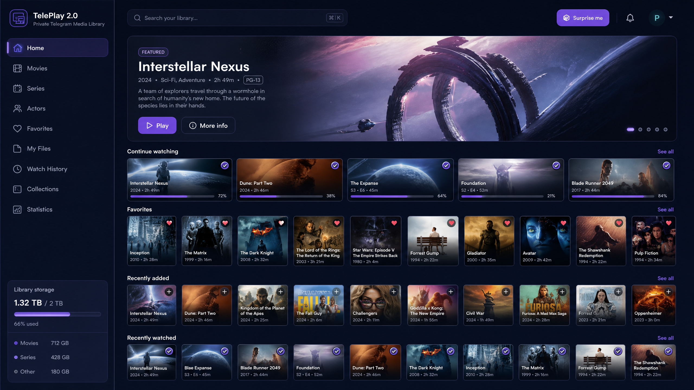
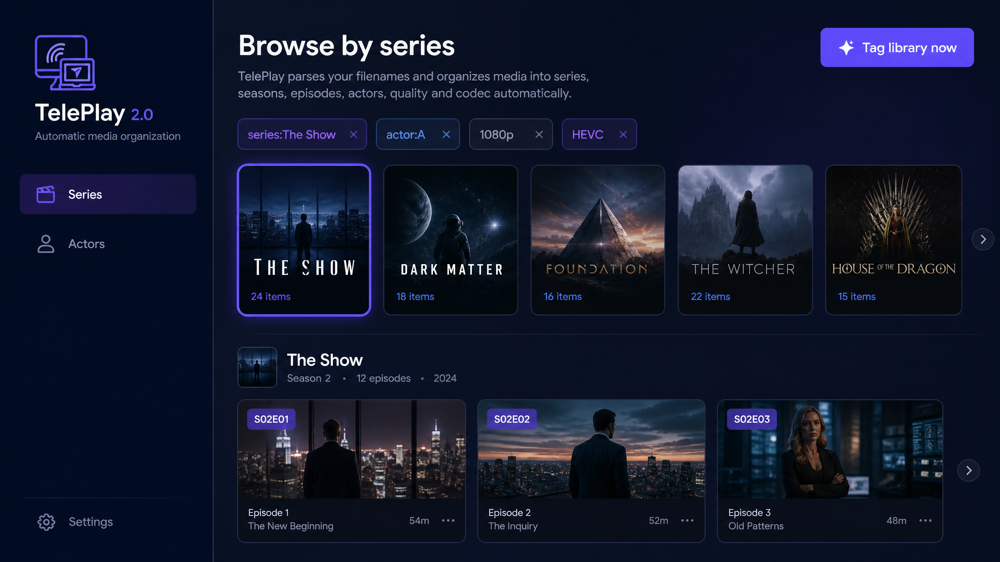

# TelePlay 2.0

**A private, Telegram-backed media center for your browser, Android device, and TV.**

TelePlay lets you send media to a Telegram bot, keep the source files in a private Telegram storage channel, and stream them on demand through a self-hosted application. The current 2.0 experience adds a cinematic home dashboard, persistent playback state, automatic filename indexing, and direct browsing by series or actor.

<p align="center">
  
</p>

<p align="center">
  <a href="https://github.com/Psrpis/Teleplay-2"></a>
  
  
  
  
</p>

> **Design note:** The screenshots in this README are product mockups that communicate the intended 2.0 visual language. Artwork and sample titles shown in them are illustrative.

## What TelePlay 2.0 provides

TelePlay keeps the original Telegram-first workflow while adding media-center organization around the private library. Files remain addressable from the existing browser and player, while the new Home, Series, Actors, Favorites, History, Collections, and Statistics views provide faster discovery.

| Capability | What it does |
| --- | --- |
| Private Telegram storage | Stores media in a private Telegram channel and keeps application metadata in SQLAlchemy-backed storage. |
| On-demand streaming | Streams Telegram content through the existing FastAPI player path instead of requiring a complete local download. |
| Cinematic Home | Combines a featured item with Continue Watching, Favorites, Recently Added, Recently Watched, and Collections shelves. |
| Playback memory | Tracks current position, progress percentage, watched state, and viewing history. |
| Automatic indexing | Reads common filename patterns for series, seasons, episodes, actors, quality, and codec. |
| Series discovery | Groups episodes by a normalized `series:` tag, even when files are in different folders. |
| Actor discovery | Groups every file carrying the same `actor:` tag across unrelated series and films. |
| Global search | Searches filenames and cached metadata with filters for type, watched state, favorites, tags, collection, year, and sort order. |
| Personal organization | Supports favorites, collections, reusable tags, metadata, preferences, and statistics. |
| Multi-device API | Exposes additive media-center endpoints for web, Android, and Android TV clients. |

## Filename indexing

When a file is uploaded, TelePlay treats its filename as an indexing hint without changing the original Telegram filename. A pattern such as:

```text
The.Show.S02E05.oyuncuA.And.oyuncuB.1080p.HEVC.mkv
```

is converted into searchable facets:

```text
series:The Show
season:2
episode:5
actor:A
actor:B
quality:1080p
codec:hevc
```

The parser also recognizes common `S01E02` and `1x02` episode forms, common resolution labels, and common codec labels. Existing libraries can be processed with the **Tag library now** action on the Series or Actors page, or with `POST /api/media/auto-tag`.

<p align="center">
  
</p>

## Main user flows

### Upload and watch

1. Send a video, audio file, or supported document to the TelePlay Telegram bot.
2. The bot forwards the media to the configured private storage channel.
3. TelePlay stores the file record and automatically creates filename-derived tags.
4. Open the web application or Android client.
5. Select a media item and stream it through the existing player.
6. Playback position is synchronized and completed viewing is added to history.

### Find a series

Open **Series**, select a normalized series tag, and browse all matching episodes. Folder placement does not affect the result because the relationship is stored through namespaced tags rather than physical folder paths.

### Find an actor across different series

Open **Actors**, select an actor tag, and view every file carrying that actor facet. This makes an actor discoverable across different series, movies, and folders.

### Backfill an existing library

Automatic tagging runs for new uploads. For existing files, open **Series** or **Actors** and select **Tag library now**. The same operation is available through the API:

```bash
curl -X POST "http://localhost:8000/api/media/auto-tag?limit=5000" \
  -H "Authorization: Bearer <access-token>"
```

## Media-center API

All endpoints require the existing authenticated bearer token and are available under `/api/media`.

| Area | Endpoints |
| --- | --- |
| Home and search | `GET /home`, `GET /search`, `GET /surprise` |
| Favorites | `GET /favorites`, `POST` and `DELETE /files/{id}/favorite` |
| Watched state | `PUT /files/{id}/watched` |
| Progress and history | Existing progress endpoint, `GET` and `DELETE /history` |
| Collections | `GET` and `POST /collections`, collection update/delete/item replacement endpoints |
| Tags | `GET` and `POST /tags`, `DELETE /tags/{id}`, `PUT /files/{id}/tags` |
| Automatic indexing | `POST /auto-tag`, `POST /files/{id}/auto-tag`, `GET /tags?kind=series`, `GET /tags?kind=actor` |
| Metadata | `GET` and `PUT /files/{id}/metadata` |
| Personal data | `GET` and `PUT /preferences`, `GET /stats` |

## Architecture

```text
Telegram Bot
    │
    ├── forwards uploads to the private storage channel
    ├── extracts filename facets
    └── creates File, MediaMetadata, Tag, and FileTag records
             │
             ▼
FastAPI backend ───────── SQLAlchemy ───────── PostgreSQL or SQLite
    │
    ├── authentication and user isolation
    ├── media-center API
    ├── filename indexing and search
    └── streaming and playback progress
             │
             ├── React + TypeScript web application
             └── Kotlin Android TV/mobile clients
```

TelePlay does not use an external metadata provider for the automatic filename index. Cached descriptive metadata and artwork can be entered through the metadata endpoint, and a legal provider integration can be added later without changing the private-file source of truth.

## Quick start with Docker

### Prerequisites

You need Docker, a Telegram bot token, a Telegram API ID and hash, and a private Telegram channel where the bot has administrator access.

| Requirement | Source |
| --- | --- |
| Telegram bot token | [@BotFather](https://t.me/BotFather) |
| Telegram API ID and hash | [my.telegram.org](https://my.telegram.org) |
| Private storage channel | Create a private channel and add the bot as an administrator |
| Docker | [Docker installation guide](https://docs.docker.com/get-docker/) |

### Configure and run

```bash
git clone https://github.com/Psrpis/Teleplay-2.git
cd Teleplay-2
cp .env.example .env
```

Set the required values in `.env`:

```env
TELEGRAM_API_ID=12345678
TELEGRAM_API_HASH=your_api_hash
TELEGRAM_BOT_TOKEN=123456:your_bot_token
TELEGRAM_STORAGE_CHANNEL_ID=-1001234567890
JWT_SECRET=generate-a-long-random-secret

POSTGRES_USER=postgres
POSTGRES_PASSWORD=change-this-password
POSTGRES_DB=telegram_tv
WEB_BASE_URL=http://localhost
```

Start the stack:

```bash
docker compose up -d --build
```

The default services are:

| Service | Address |
| --- | --- |
| Web application | `http://localhost` |
| Backend API | `http://localhost:8000` |
| API documentation | `http://localhost:8000/docs` |

## Local development

### Backend

```bash
cd backend
python3 -m venv .venv
source .venv/bin/activate
pip install -r requirements.txt
python3 -m compileall -q app
pytest -q
```

Set `DATABASE_URL` to a PostgreSQL URL for production-like development or an async SQLite URL for local testing:

```env
DATABASE_URL=sqlite+aiosqlite:///./data/teleplay.db
```

### Web application

```bash
cd web
npm ci
npm run dev
npm run build
npx tsc --noEmit
npm run lint
```

### Android

Open `android/` in Android Studio. The repository contains Kotlin API and repository support for the media-center Home, favorites, watched state, search, tags, and automatic tag backfill. A configured Android SDK is required for Gradle builds.

## Repository structure

```text
Teleplay-2/
├── backend/
│   ├── app/
│   │   ├── bot.py                 # Telegram ingestion and bot commands
│   │   ├── models.py              # Core and media-center SQLAlchemy models
│   │   ├── services.py            # Filename facets, auto-tagging, shared queries
│   │   └── routers/
│   │       ├── media.py           # Home, search, tags, collections, history, stats
│   │       ├── files.py           # File browsing, progress, and file mutations
│   │       └── tv.py              # TV-oriented browse endpoints
│   └── tests/                     # Media-center unit tests
├── web/
│   └── src/
│       ├── components/
│       │   ├── MediaCenterPage.tsx
│       │   ├── TagBrowserPage.tsx
│       │   ├── MediaCard.tsx
│       │   └── MediaUtilityPages.tsx
│       └── lib/api.ts             # API client and React Query hooks
├── android/                       # Kotlin Android TV/mobile client
├── docs/
│   ├── assets/                    # README product visuals
│   ├── ARCHITECTURE.md
│   ├── DEPLOYMENT.md
│   ├── MEDIA_CENTER.md
│   ├── RELEASING.md
│   └── SETUP.md
├── docker-compose.yml
└── .env.example
```

## Verification

The current implementation has been checked with:

```bash
cd backend && pytest -q && python3 -m compileall -q app
cd ../web && npx tsc --noEmit && npm run build && npm run lint
```

The Android source requires a configured Android SDK. If Gradle reports `SDK location not found`, define `ANDROID_HOME` or add `android/local.properties` with a valid `sdk.dir`.

## Documentation

| Guide | Purpose |
| --- | --- |
| [Media Center guide](docs/MEDIA_CENTER.md) | Media-center data model, API additions, automatic indexing, and database behavior |
| [Setup guide](docs/SETUP.md) | Bot commands, authentication, and user setup |
| [Deployment guide](docs/DEPLOYMENT.md) | Docker, VPS, Railway, Render, and CapRover deployment |
| [Architecture guide](docs/ARCHITECTURE.md) | Streaming engine, security, and project architecture |
| [Releasing guide](docs/RELEASING.md) | Android build and release workflow |

## Security and privacy

TelePlay applies authentication and user-scoped queries to media-center data. The server stores Telegram session state and application metadata, while source media remains in the configured Telegram storage channel. Use a strong JWT secret, protect the storage channel, restrict `AUTH_USERS` when appropriate, and place the deployment behind HTTPS for production use.

## Contributing and license

Contributions are welcome. Please open an issue or pull request with a focused description of the change and its verification steps.

TelePlay is distributed under the MIT License. See [LICENSE](LICENSE) for details.

## References

[1]: https://core.telegram.org/api "Telegram API documentation"
[2]: https://fastapi.tiangolo.com/ "FastAPI documentation"
[3]: https://react.dev/ "React documentation"
[4]: https://developer.android.com/training/tv/compose "Jetpack Compose for TV documentation"
